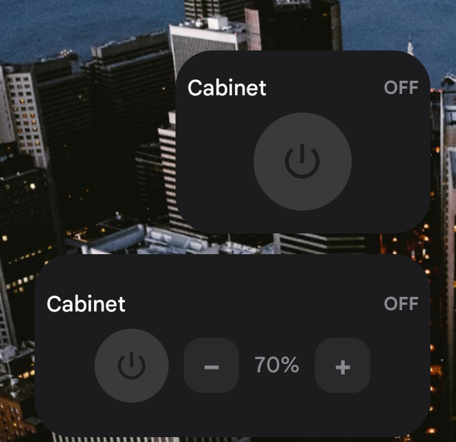
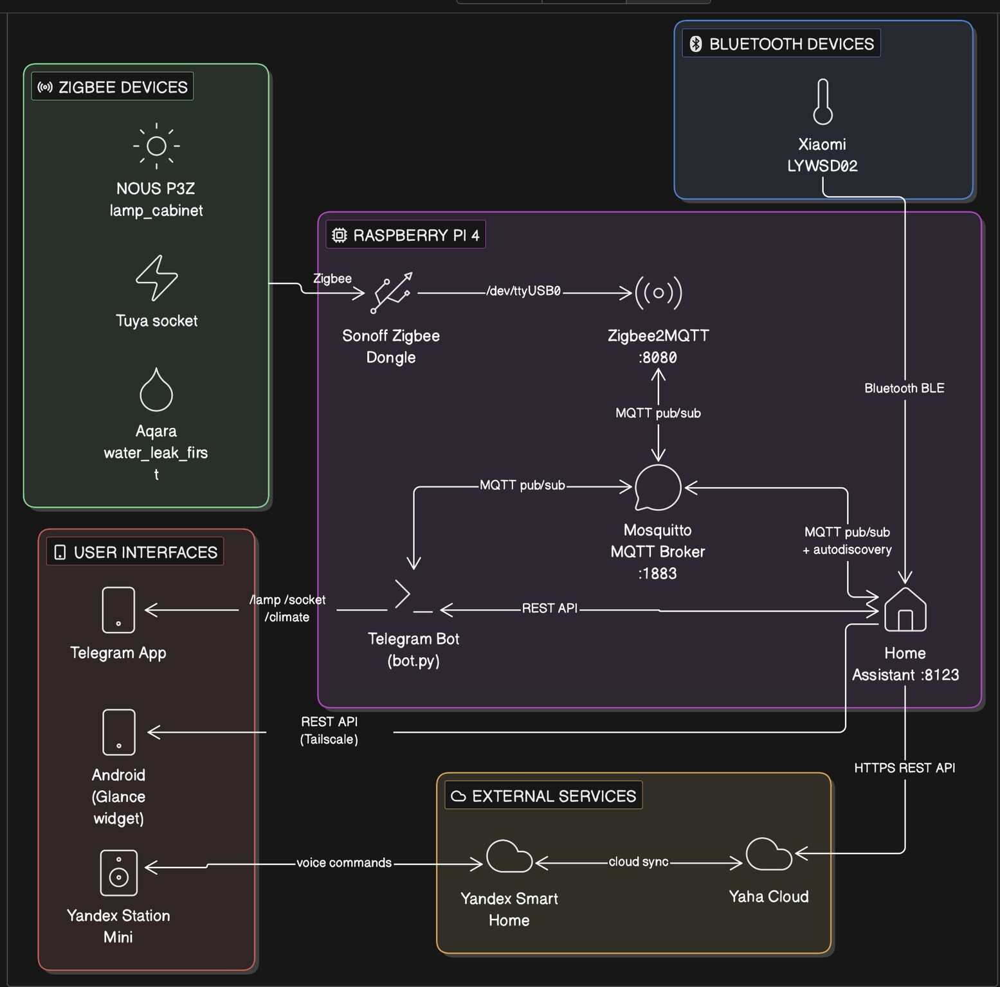

# MyLamp

An Android app that controls a single smart lamp through several **independent** transports — WiFi/MQTT, a REST API via Home Assistant, and (planned) direct BLE to a Raspberry Pi — plus a pair of Jetpack Glance home-screen widgets. Built as a personal pet project for a real home setup, and as a hands-on playground for Jetpack Compose, Glance, and a light Clean Architecture split.



## Why three transports for one lamp?

Not redundancy for its own sake — each transport is a deliberately independent demo of a different way an Android app can reach a smart-home device, from "talk to the broker directly" to "go through an automation platform" to "talk to a microcontroller over Bluetooth with no cloud/network involved at all":

| Screen | Transport | Status |
|---|---|---|
| REST | HTTP → Home Assistant `light.turn_on`/`turn_off` | ✅ Working, controls a real Zigbee lamp |
| WiFi | Direct MQTT publish to Mosquitto on a Raspberry Pi | 🚧 Stub screen, not wired up yet |
| BLE | GATT to a peripheral service on the Pi (Pi republishes to MQTT) | 🚧 Stub screen, Pi-side service not built yet |

## Home-screen widgets

Two separate pickable [Jetpack Glance](https://developer.android.com/jetpack/androidx/releases/glance) widgets (not one resizable widget) — a compact 2×2 power-only toggle, and a wider 3×2 with power + brightness `−`/`+` controls. Both call the same REST path as the in-app REST screen, and the power button's own color doubles as the on/off indicator instead of relying on text alone.

## Architecture

The REST screen and the widget follow a light Clean Architecture split — `UI → ViewModel → Repository → DataSource`, no usecase layer, no DI framework:

```
domain/    LampRepository            — the only interface the ViewModel/widget depend on
data/      HomeAssistantApi/Client   — Retrofit + OkHttp + Moshi
           HomeAssistantLampRepository — sole LampRepository implementation
rest/      RestScreen (UI only), RestLampViewModel, RestScreenUiState (sealed: Idle/Sending/Ready)
widget/    Glance AppWidgets + ActionCallbacks — call LampRepository directly
           (a Glance AppWidget has no ViewModelStoreOwner, so it can't hold a ViewModel)
```

The WiFi and BLE screens are still simple local-state stubs and will get the same layering once actually implemented.

### Where this fits in the bigger home setup

MyLamp's REST screen is one more client of the same Home Assistant instance that already ties together Zigbee devices, a Telegram bot, and voice control:



## Tech stack

- Kotlin, Jetpack Compose, Jetpack Glance (app widgets)
- Retrofit + OkHttp + Moshi (reflection-based, no codegen)
- Kotlin Coroutines/Flow for everything async — no RxJava
- detekt + ktlint, wired into the build with a baseline that grandfathers pre-existing code
- Min SDK 28, target/compile SDK 37, Java 21 source/target compatibility

## Getting started

1. Copy the secrets template and fill in your own values:
   ```
   cp app/src/main/java/com/yahorshymanchyk/mylamp/secrets/Secrets.kt.template \
      app/src/main/java/com/yahorshymanchyk/mylamp/secrets/Secrets.kt
   ```
   `Secrets.kt` is gitignored and never committed. You'll need a running [Home Assistant](https://www.home-assistant.io/) instance, a [long-lived access token](https://www.home-assistant.io/docs/authentication/#your-account-profile), and the `entity_id` of a light entity for the REST screen and widgets to work.
2. Build and install:
   ```
   ./gradlew installDebug
   ```
3. Static analysis:
   ```
   ./gradlew :app:detekt
   ./gradlew :app:ktlintCheck
   ```

On this Android version, reaching a local-network address (e.g. `192.168.1.x`) also requires the `android.permission.ACCESS_LOCAL_NETWORK` runtime permission — the app requests it once at startup, covering all three screens.

## Development notes

This project's iteration history (design decisions, dead ends, and why) lives in [`PLAN.md`](PLAN.md) — kept as a running log rather than squashed away, including a couple of Clean-Architecture and widget-layout revisions made along the way. Larger changes went through a small custom multi-agent review chain (`.claude/skills/swarm`) — a researcher drafts a plan, a human approves it, an executor implements it, and a reviewer checks the result before it's considered done.

## License

[MIT](LICENSE)
